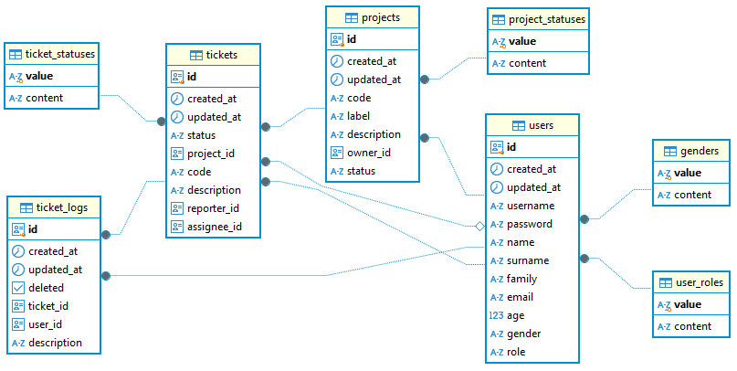

# SoftuniTicketsApp

A repo for a Angular course at Softuni october 2024

## Environment requirements
# Node 
npm 10.9.0
# Angular CLI
Angular CLI: 18.2.11
# Docker
Docker version 27.3.1

## Installation
Run  `git clone ...`
change directory:  `cd ..`
RUN `docker-compose up --build -d`

## Ports for access with credentials from docker-compose file
app port: 4200
hasura console: 8082
postgres: 5433 

## Data model : ERD

## Development

This project was generated with [Angular CLI](https://github.com/angular/angular-cli) version 18.2.5.

## Development server
Run `ng serve` for a dev server. Navigate to `http://localhost:4200/`. The application will automatically reload if you change any of the source files.

## Code scaffolding

Run `ng generate component component-name` to generate a new component. You can also use `ng generate directive|pipe|service|class|guard|interface|enum|module`.
Run `ng generate @angular/material:table authorized/tickets/tickets-list` to generate angular table component with schematics. 
ng generate @angular/material:address-form ....

## Build

Run `ng build` to build the project. The build artifacts will be stored in the `dist/` directory.

## Running unit tests

Run `ng test` to execute the unit tests via [Karma](https://karma-runner.github.io).

## Hasura - GraphQl engine with DBMS and UI console
https://hasura.io/docs/2.0/hasura-cli/commands/hasura_init/
Run `npm i --save-dev hasura-cli@2.36.1`
RUN `npm run hasura`
# For adding configuration, metadata and migrations folders
RUN `npm run hasura init graphql`

## Apollo-Angular
`ng add apollo-angular`
`npm install --save-dev @graphql-codegen/cli @graphql-codegen/typescript @graphql-codegen/typescript-apollo-angular @graphql-codegen/typescript-operations`
`npm i apollo-link-context` //for the connection settings

## Types scaffolding
RUN `` for regeneration of types

## Hasura migrations
For squash migrations use the global hasura-cli: 
hasura migrate squash --skip-update-check --database-name="default" --delete-source --name "enumerators" --from 1730973747412
hasura migrate squash --skip-update-check --database-name="default" --delete-source --name "users" --from 1730988457620
hasura migrate squash --skip-update-check --database-name="default" --delete-source --name "projects" --from 1730988852144
hasura migrate squash --skip-update-check --database-name="default" --delete-source --name "users" --from 1730989449789

npm run hasura metadata export

hasura metadata apply
hasura migrate apply --database-name <database-name>
hasura metadata reload
npm run hasura migrate apply     --database-name "default"
npm run hasura metadata apply     --database-name="default"