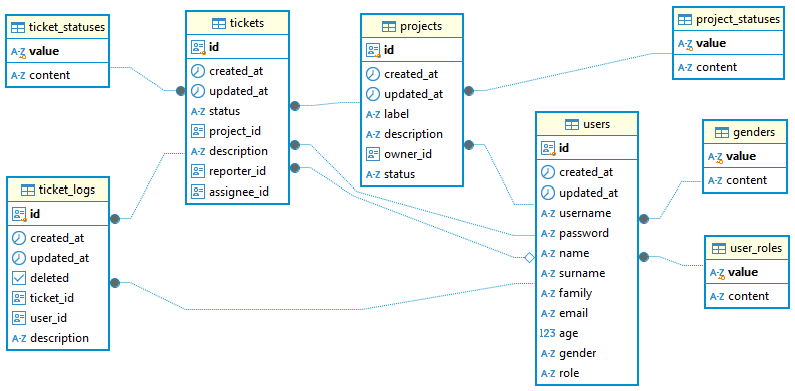

# Application for the managing data for Users/Projects/Tickets

Repo for the exam task for the Angular course, Softuni October 2024

## Environment requirements:

- Node: 22.9.0
- Angular CLI: 18.2.11
- Package Manager: npm 10.9.0
- Docker version: 27.3.1

## Installation

```bash
# clone repo
git clone https://github.com/peshoni/softuni-angular.git

# move to project directory
cd softuni-angular

# Install application
npm install

# Build the images and run as containers
docker-compose up --build -d

# Check containers:
docker container ls

# Applies metadata over Hasura and Postgres
npx hasura metadata apply

# Applies migrations over the Postgres
npx hasura migrate apply --database-name default

# Hydrates database with a mock data (.sql files from the /seeds/default/ folder)
npx hasura seeds apply --database-name default
``` 

## Exposed containers:  

1. Angular application : localhost:4200
2. Hasura console:       localhost:8082
3. Postgres:             localhost:5433 
```bash
docker container ls
```

## Tech stack


## Data model : ERD


## Development
This project was generated with [Angular CLI](https://github.com/angular/angular-cli) version 18.2.5.

## Development server
Run `ng serve` for a dev server. Navigate to `http://localhost:4200/`. The application will automatically reload if you change any of the source files.

## Code scaffolding
```bash
ng generate directive|pipe|service|class|guard|interface|enum|module
# Generate a table component with Angular Schematics
ng generate @angular/material:table path/component-name
# Generate an address form component with Angular Schematics:
ng generate @angular/material:address-form path/component-name
```

## Build

Run `ng build` to build the project. The build artifacts will be stored in the `dist/` directory.

## Running unit tests

Run `ng test` to execute the unit tests via [Karma](https://karma-runner.github.io).


## Hasura - GraphQl engine with DBMS and UI console
https://hasura.io/docs/2.0/hasura-cli/commands/hasura_init/
Run `npm i --save-dev hasura-cli@2.36.1`
RUN `npm run hasura`
# For adding configuration, metadata and migrations folders
RUN `npm run hasura init graphql`

## Apollo-Angular
`ng add apollo-angular`
`npm install --save-dev @graphql-codegen/cli @graphql-codegen/typescript @graphql-codegen/typescript-apollo-angular @graphql-codegen/typescript-operations`
`npm i apollo-link-context` //for the connection settings

## Types scaffolding
RUN `` for regeneration of types

## Hasura metadata
Run `npm run hasura metadata export` to export current connected database metadata
Run `npm run hasura metadata apply` to apply state of metadata from the current git branch over connected database 
hasura metadata apply
hasura metadata reload
npm run hasura metadata apply  --database-name="default"

## Hasura migrations
For squash migrations use the global hasura-cli: 
hasura migrate squash --skip-update-check --database-name="default" --delete-source --name "enumerators" --from 1730973747412
hasura migrate squash --skip-update-check --database-name="default" --delete-source --name "users" --from 1730988457620
hasura migrate squash --skip-update-check --database-name="default" --delete-source --name "projects" --from 1730988852144
hasura migrate squash --skip-update-check --database-name="default" --delete-source --name "users" --from 1730989449789

hasura migrate apply --database-name <database-name>

npm run hasura migrate apply     --database-name "default"
